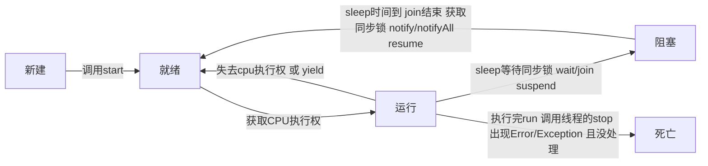

#  笔记

## Java学习路线

Core Java ----> Java与数据库  ----> Java Web技术 ----> 项目实战 ----> 大型架构  + 专项精进

Core Java


Java与数据库


Java Web


项目实战


### 面向对象的三条主线

1. java类及类的成员：属性、方法、构造器； 代码块、内部类
2. 面向对象的三大特征：封装、继承、多态、（抽象性）
3. 其它关键字：this、super、static、final、abstract、interface、package、import


面向过程：强调功能行为，以函数为最小单位，考虑怎么做

面向对象：强调具备功能的对象，以类/对象为最小单位，考虑谁来做


面向对象程序设计的重点是类的设计，类的设计是类的成员的设计。

属性 = 成员变量 = field = 域、字段

方法 = 成员方法 = 函数 = method

创建类的对象 = 类的实例化 = 实例化类


## 类和对象的使用：

创建类     ----->   创建类的对象    ----->    对象.属性  对象.方法

如果创建了一个类的多个对象，每个对象都独立拥有一套属性。


## 对象的内存解析：

**堆（Heap）** 唯一目的就是存放对象实例，也就是说创建对象的实体都在堆中。补充：类的属性（非static）加载在堆空间中。

**虚拟机栈（Stack）**用于 存储局部变量

**方法区（Method Area）** 用于存储已被虚拟机加载的类信息、常量池、静态变量（static）、即时编译器编译后的代码

Person p3 = p1; 这种情况 p3 也指向 p1 所指向的堆区存储，并不是具有独立的一套

引用类型的变量，只可能存储两类值： null 或 地址值（含变量的类型）

Student[ ] stus = new Student[5]; 此处不应该理解为创建装了5个对象的数组，应该理解为： stus 为数组引用类型，指向一个数组；而数组存储的数据 是  student  引用类型，但是现在这些引用类型值也是null，尚未指向任何对象。需要将该类型指向new 的student对象。


## 类中属性的使用

属性（成员变量） vs 局部变量

1. 相同点

   - 定义变量的格式：数据类型 变量名 = 变量值

   - 先声明，后使用

   - 变量都有其对应的作用域

   

2. 不同点

   - 在类中声明的位置不同：属性定义在类的一对{}中， 局部变量声明在方法内、方法形参、代码块内、构造器形参、构造器内部的变量

   - 关于权限修饰符的不同：属性可以在声明属性时，指明其权限，使用权限修饰符。常见权限修饰符：private、public、缺省、protected   ----> 封装性     ; 局部变量不可以使用权限修饰符

   - 默认初始化值不同：类的属性根据类型都有默认初始化值。整型（byte、short、int、long）：0   浮点型（float、double）：0.0    字符型（char）：0（或 '\u0000'） 布尔型（boolean）： false   引用数据类型（类、数组、接口）：null       ；局部变量没有默认初始化值，调用之前需要显式赋值，特别地，形参调用时赋值。

   - 在内存中加载的位置不同：属性加载在对空间中（对象实体在堆中）（非static）；   局部变量加载到栈空间

   

## 类中方法的声明和使用

方法：描述类应该具有的功能

方法的声明：   权限修饰符 返回值类型 方法名（形参列表）{ 方法体 }

​	 注意：static、final、abstract 来修饰的方法，后续解释

说明：

- 权限修饰符： private、public、缺省、protected   默认使用public来修饰
- 返回值类型：有返回值，则必须在方法声明时指定返回值得类型，同时方法中需要使用return关键字来返回指定类型的变量和常量；     如果方法没有返回值，则方法声明时，使用void表示，可以不用return，也可以使用return；来结束方法。  是否需要返回值：由 问题需求 和 经验 确定
- 方法名：属于标识符，遵循标识符的规则和规范，见名知意
- 形参列表：方法可以声明 0~多 个形参； 格式： 数据类型1 形参1，数据类型2 形参2，...

return 作用于方法体中，用于：1、结束方法， 2、返回所需的数据   

方法的使用中，可以调用当前类的属性和方法，特殊的方法A调用了方法A：递归

方法里不可定义方法


### 函数重载：

两同一不同：

- 同一个类、相同方法名
- 参数列表不同：参数个数不同，参数类型不同

与方法的权限修饰符、返回值类型、形参变量名、方法体都没有关系！

在通过对象调用方法时，如何确定某一个指定的方法：  方法名  ----> 参数列表


### 可变个数参数：

可变个数参数的格式： 数据类型  ... 变量名

当调用可变个数形参的方法时，传入的参数个数可以是：0、1、2、。。。个

可变个数形参的方法与本类中方法名相同，形参不同的方法之间构成重载

可变个数形参的方法与本类中方法名相同，形参类型也相同的数组之间不构成重载

可变个数形参在方法的形参中，必须声明在末尾

可变个数形参在方法的形参中，最多只能声明一个可变形参


### 关于变量的赋值

如果变量是基本数据类型，此时赋值的是变量所保存的数据值

如果变量是引用数据类型，此时赋值的是变量所保存的数据的地址值

### 方法的形参的传递机制：值传递机制

如果参数是基本数据类型，此时实参赋给形参的是实参真实存储的数据值

如果参数是引用数据类型，此时实参赋给形参的是实参存储数据的地址值


## 面向对象特性一：封装性

#### 权限修饰符

Java权限修饰符置于 类的成员 定义之前，用来限定对象对该类成员的访问权限

限制了可见性，但是实际是存在的


1. Java规定的4种权限（从小到大排列）：private、缺省、protected、public

2. 具体的，四种权限都可以用来修饰类的内部结构：属性、方法、构造器、内部类

   ​				修饰类的只可以使用 缺省 和 public

  


### 构造器

构造方法、constructor 的使用

一、构造器的作用：

​	创建对象、初始化对象结构

二、说明

1. 如果没有显式的定义类的构造器的话，则系统默认提供一个空参的构造器
2. 定义构造器的格式：权限修饰符 类名（形参列表）
3. 一个类中可以多个构造器，构成重载
4. 一旦显示定义类的构造器，系统就不再提供默认的空参构造器
5. 一个类中至少一个构造器

属性赋值的先后顺序：默认初始化、显示初始化、构造器中赋值、通过”对象.方法" 或 “对象.属性" 的方式赋值


## 关键字

#### this可以用来修饰、调用：属性、方法、构造器

在类的方法中，我们可以使用 "this.属性" 或 " this.方法 " 的方式，调用当前对象属性或方法，但是通常情况下省略”this“，特殊情况下，出现方法的形参和类的属性同名时，必须使用 "this.属性" 的方式调用。构造器中也可以这样使用

 构造器里面可以调用构造器

#### this调用构造器

1. 在类的构造器中，可以显式的使用“this（形参列表）”方式，调用本类中指定的其他构造器
2. 构造器中不能通过 “this(形参列表)”方式调用自己
3. 如果一个类中有n个构造器，则最多有 n-1构造器使用（防止环形出现死循环）
4. 规定调用 “this(形参列表)” 必须声明在当前构造器的首行，且最多只能声明一个

#### package

1. 为了更好的实现项目中类的管理，提供包的概念
2. 使用package声明类或接口所属的包，声明在源文件的首行
3. 包 属于标识符 ，遵循标识符的命名规则规范
4. 每 “.” 一次，就代表一层文件目录

补充：同一个包下，不能命名同名的接口、类； 不同的包下可以同名

#### import

1. 在源文件中显式的使用import结构导入指定包下的类、接口
2. 声明在包的声明和类的声明之间
3. 如果需要导入多个结构，则并列写出即可
4. 可以使用“XXX.*"的方式，表示导入XXX包下的所有结构
5. 使用的类或接口 是 Java.lang 包下定义的，则可以省略 import 结构
6. 使用的类或接口是本包下定义的，可以省略import 结构
7. 如果在源文件中使用了不同包下同名的类，则必须至少有一个类需要以全命名的方式显示
8. 如果使用 ”xxx.*“方式表明可以调用XXX包下的所有结构，但是如果使用的是xxx子包下的结构，仍然需要显式声明
9. import static   导入指定类或接口中的静态结构： 属性或方法 


## 面向对象特性二：继承性

一、继承性的好处：

1. 减少了代码的冗余，提高了代码的复用性
2. 便于功能的扩展
3. 为之后多态性的使用，提供了前提

二、继承性的格式： class A extends B { } 

- A：子类、派生类、subclass
- B：父类、超类、基类、superclass
- 一旦子类A继承父类B以后，子类A中就获取了父类B中声明的结构：属性、方法。 特别的，父类中声明为private的属性或方法，子类继承父类以后，仍然认为获取了父类中私有的结构。只是因为封装性的影响，使得子类不能直接调用父类的结构而已。
- 子类继承父类后，还可以声明自己特有的属性和方法，实现功能的扩展
- extends 延展、扩展

三、Java中一些规定

1. 一个类可以被多个子类继承
2. 一个类只能有一个父类：单继承
3. 可以多重继承
4. 子类直接继承的父类称为：直接父类。间接继承的父类称为：间接父类
5. 子类继承父类后，就获取了直接父类和所有间接父类中声明的属性和方法

四、

1. 如果我们没有显示的定义一个类的父类的话，则此类继承与java.lang.Object类
2. 所有java类（除java.lang.Object类之外)。都直接或间接继承与java.lang.Object类
3. 意味着所有类都具有 java.lang.Object 类声明的功能


### 方法的重写 overwrite

重写：子类继承父类以后，可以对父类中同名参数的方法，进行覆盖操作

应用：重写以后，当创建子类对象以后，通过子类对象调用子父类中的同名同参数的方法时，实际执行的是子类重写父类的方法。

重写的规定：

```shell
方法的声明：权限修饰符 返回值类型 方法名（形参列表）{
				// 方法体
		  }
```

一般称呼： 子类中的叫 重写的方法， 父类中的叫做 被重写的方法

1. 子类重写的方法的方法名和形参列表与父类被重写的方法的方法名和形参列表相同

2. 子类重写的方法的权限修饰符不小于父类被重写的方法的权限修饰符 cannot reduce the visibility of the inherited method from XXX子类不能重写父类中 private 的方法

3. 返回值类型：

   父类被重写的方法的返回值类型是void，则子类重写的方法的返回值类型只能是void 

   父类被重写的方法的返回值类型是A类型，则子类重写的方法的返回值类型可以是A类或A类的子类

   父类被重写的方法的返回值类型是基本数据类型，则子类重写的方法的返回值类型必须是相同的基本数据类型

4. 子类重写的方法抛出的异常类型不大于父类被重写的方法抛出的异常类型

子类和父类中的同名同参数的方法要么都声明为非static的（考虑重写）。要么都声明为static的（不是重写）


#### super 关键字

1. super理解为：父类的

2. super可以用来调用：属性、方法、构造器

3. 可以在子类的方法 或者 构造器中，通过使用 “ super.属性" 或 " super.方法 " 的方式，显示的调用父类中声明的属性或方法，但是，通常情况下，习惯上省略 ”super "  。特殊情况，当子类和父类中出现同名的属性时，想要在子类中调用父类中声明的属性，需要显式使用super了；同理，子类中重写了父类方法时，想要调用被重写的方法，也需要显示调用super

4. super 调用构造器

   可以在子类的构造器中显示的使用 " super(形参列表) " 的方式，调用父类中声明的指定的构造器；    

    “ super( 形参列表 ) “ 的使用，必须声明在子类构造器的首行；  

   在类的构造器中，针对 ” this( 形参列表 )“ 或 " super(形参列表) " 只能二选一，不能同时出现；     

   类的构造器中，针对 this(形参列表) 或者 super(形参列表) 只能二选一，不能同时出现；

   在构造器首行没有显示声明   this(形参列表) 或者 super(形参列表) 时，则**默认调用的是父类中的空参构造器 super( )**；这里可能在编写程序中出现以下的现象：在父类中编写了带参的构造器，此时不提供默认的空参构造器，这时子类的构造器中由于默认会调用 super( )，而super( ) 不存在，导致出错。故可以显式的使用 super(参数) .

   在类的多个构造器中，至少有一个类的构造器中使用了” super( 形参列表 )“，调用父类的构造器。

   

   #### 子类对象实例化的全过程

   1、从结果上来看：（继承性）

   ​		子类继承父类以后，就获取了父类中声明的属性或方法

   ​		创建子类的对象，在堆空间中就会加载所有父类中声明的属性

   2、从过程上来看：

   ​		当我们通过子类的构造器创建子类对象时，我们一定会直接或间接的调用其父类的构造器，进而调用父类的构造器，直到调用了 java.lang.Object 类中空参的构造器为止，正因为加载过所有的父类的结构，所以才可以看到内存中父类中的结构，子类对象才可以考虑进行调用。

   需要注意的是，虽然调用了父类的构造器，但是一直都只有一个对象。

   

## 面向对象特性三：多态性

对象的多态性：父类的引用指向子类的对象。

多态的使用：*当调用子父类同名同参的方法时*，实际执行的是子类重写父类的方法

  					 编译看左边，运行看右边

多态性的使用前提： 1、类的继承关系，  2、方法的重写

对象的多态性，只适用于方法，不适用于属性

方法的调用是在运行时确定的，动态绑定

对于重载而言，在方法调用之前，编译器就已经确定了所要调用的方法，这称为 **"早绑定" 或 " 静态绑定 "**；对于多态，只有等到方法调用的那一刻，编译器才会确定所需调用的具体方法，这称为 **” 晚绑定“ 或 ” 动态绑定 “**。

有了对象的多态性以后，内存中实际是加载了子类特有的属性和方法的，但是由于变量声明为父类类型，导致编译时，只能调用父类中声明的属性和方法。子类特有的属性和方法不能调用**；如果想要子类特有的属性和方法，可以使用向下转型：使用强制类型转换符**。使用强转时，可能出现 ClassCastException 的异常。

向上的自动类型提升 就是 多态

##### instanceof 关键字 

a instanceof A : 判断对象a是否是类A的实例；如果是true，否则false。

使用情景：为了避免在向下转型时出现异常，先使用instanceof判断，再进行向下转型

如果类B是类A的父类，且 a instanceof A 返回 true，则 a instanceof B 返回 true

#### 一些总结：

子类重写父类的方法：编译看左边，运行看右边

子类出现与父类同名的属性：编译和运行都看左边

 

## Object 类

Object类是所有java类的根父类，如果在类的声明中未使用extends关键字指明其父类，则默认父类为java.lang.object类

Object 类中的功能（属性、方法）就具有通用性。

- 属性：无
- 方法：equals( ) / toString( ) / getClass( ) / hashCode( ) / clone( ) / finalize( ) / wait ( )

Object类只声明了一个空参构造器


#### == 和 equals( ) 区别

**==：运算符**

1. 可以使用在基本数据类型变量和引用数据类型变量中
2. 如果比较的是基本数据类型变量：比较两个变量保存的数据是否相等。（不一定类型要相同）  如果比较的是引用数据类型变量：比较两个对象的地址值是否相同，即两个引用是否指向同一个对象实体

**Object类中 equals( ) 方法**

1. 是一个方法，而不是运算符

2. 只能适用于引用数据类型

3. Object类中equals( ) 的定义为：

   ```java
   public boolean equals(Object obj) {
       return (this == obj);
   }
   ```

   说明：Object 类中定义的equals( ) 和 == 的作用是相同的，比较两个对象的地址值是否相同，即两个引用是否指向同一个对象实体；

4. 类似于String、Data、File、包装类等都重写了Object类中的equals( ) 方法。重写以后，比较的不是两个引用的地址是否相同，而是比较两个对象的 “ 实体内容 ” 是否相同。

5. 通常情况下，如果想对自定义类使用 equals( ) 时，想要实现比较两个对象的实体内容是否相同，需要对Object类中 equals ( ) 进行重写

   ```java
   public boolean equals(Object obj) {
       if (obj == this)
           return true;
       if (obj instanceof User) {
           User u = (User)obj;
           return this.age == u.age && this.name.equals(u.name);
       }
       return false;
   }
   ```

   

#### Object 类中toString( )的使用：

1. 当我们输出一个对象的引用时，实际上就是调用当前对象的toString( )

2. Object类中toString( )的定义：

   ```java
   public String toString() {
       return getClass().getName() + "@" + Integer.toHexString(hashCode());
   }
   ```

3. 像String、Date、File、包装类等都重写了Object类中的toString( ) 方法。使得在调用对象的toString( ) 时，返回 " 实体内容 "信息

4. 自定义类也可以重写 toString( ) 方法，当调用此方法时，返回对象的 ”实体内容“


## 包装类

#### Java 中的 JUnit 单元测试

步骤：

1. 选中当前工程
2. 创建 Java 类，进行单元测试
3. 此时的 Java 类要求：此类是public的， 此类提供公共的无参的构造器
4. 此类中声明单元测试方法。 此时的单元测试方法：方法的权限是public，没有返回值，没有形参
5. 此单元测试方法上需要声明注解：@Test，并在单元测试类中导入：import org.junit.Test
6. 声明好单元测试方法以后，就可以在方法体内测试相关的代码


#### 包装类的使用

java 提供了8种基本数据类型对应的包装类，使得基本数据类型的变量具有类的特征；

掌握：基本数据类型、包装类、String三者直接的相互转换

1. 基本数据类型 ---> 包装类：调用包装类的构造器

2. 包装类 ---> 基本数据类型：调用包装类的 xxxValue( )

   JDK 5.0 新特性：自动装箱与自动拆箱 （替代了原始使用构造器和xxxValue( ) 的方法）

3. 基本数据类型、包装类 ---> String类型：调用String重载的valueOf（Xxx xxx)

4. String类型 ---> 基本数据类型、包装类：调用包装类的parseXxx( )


#### static关键字

1. static：静态的，主要用来修饰类的内部结构，随着类的加载而加载

2. static可以修饰：属性、方法、代码块、内部类

3. 使用static 修饰 属性：

   属性 按照是否使用static修饰，分为：静态属性(类变量) vs 非静态属性( 实例变量 )

   实例变量：我们创建了类的多个对象，每个对象都有独立的拥有一套类中的非静态属性。当修改其中一个对象中的非静态属性时，不会导致其他对象中同样的属性值的修改。

   静态变量：我们创建了类的多个对象，多个对象共享同一个静态变量。当通过某一个对象修改静态变量时，会导致其他对象调用此静态变量时，是修改过了的。

   静态变量随着类的加载而加载；可以通过" 类.静态变量 " 的方式进行调用

   静态变量的加载要早于对象的创建；

   由于类只会加载一次，则静态变量在内存中也只会存在一份：存在方法区的静态域中

4. 使用static修饰 方法：

   随着类的加载而加载；可以通过" 类.静态方法 " 的方式进行调用

   静态方法中，只能调用静态的方法或属性；非静态方法中，既可以调用非静态的方法或属性，也可以调用静态的方法或属性。

5. static 注意点：

   在静态的方法内，不能使用this关键字、super关键字

   关于静态属性和静态方法的使用，从生命周期角度理解。

6. 确定属性、方法都否需要声明为static：

   > 属性是可以被多个对象所共享的，不会随着对象的不同而不同。

   > 操作静态属性的方法，通常设置为static；

   > 工具类中的方法，习惯声明为static的。比如Math、Arrays、Collections、


### 单例设计模式

所谓类的单例设计模式，就是采取一定的方法保证在整个的软件系统中，对某个类只能存在一个对象实例。

（**饿汉式**）实现过程： 

1. 私有化类的构造器
2. 内部创建类的对象
3. 提供公共的方法，返回类的对象
4. 要求此对象也必须声明为静态的

```java
class Bank{
    private Bank() {
    }
    private static Bank instance = new Bank();
    public static Bank getInstance() {
        return instance;
    }
}
```

（**懒汉式**）实现过程：

1. 私有化类的构造器
2. 先声明当前类的对象，没有初始化
3. 声明public static 的返回当前类对象的方法 
4. 此对象也必须声明为static

```java
class Order {
    private Order() {
    }
    private static Order instance = null;
    public static Order getInstance() {
        if (instance == null)
            instance = new Order();
        return instance;
    }
}
```

区分 饿汉式 和 懒汉式

饿汉式：坏处：对象加载时间过长  好处：饿汉式是线程安全的

懒汉式：好处：延迟对象的创建    坏处：线程不安全


单例的第三种写法： 静态内部类写法 （使用时创建，线程安全）

```java
class Order {
    private Order() {}
    private static class Holder {
        static Order instance = new Order();
    }
    public static Order getInstance() {
        return Holder.instance;
    }
}
```


#### main( ) 方法的使用说明：

main( ) 方法作为程序的入口

main( ) 方法也是一个普通的静态方法

main( ) 可以作为与控制台交互的方式，之前用 Scanner


### 代码块 

类的成员之四：代码块（或 初始化块）

代码块的作用：用来初始化类、对象

代码块只能使用static修饰，由此引出分类，静态代码块  vs   非静态代码块

**对属性赋值的位置顺序：**默认初始化 - 显示初始化 / 代码块中赋值 - 构造器中初始化 - 通过对象调用赋值

**静态代码块：**

> 内部可以有输出语句
>
> 随着类的**加载而执行**（只有执行一次）；
>
> 作用：初始化类的信息 
>
> 如果一个类中定义了多个静态代码块，则按照声明的先后顺序执行
>
> 静态代码块的执行要优先于非静态代码块的执行
>
> 静态代码块内只能调用静态的属性、方法


**非静态代码块：**

> 内部可以有输出语句
>
> 随着对象的**创建而执行**（每创建一个对象执行一次）
>
> 作用：可以在创建对象时对对象的属性进行初始化
>
> 如果一个类中定义了多个非静态代码块，则按照声明的先后顺序执行
>
> 非静态代码块可以调用静态的属性、方法；也可以调用非静态的属性、方法

实际开发时，没必要多个代码块，放一块就好。


#### final 关键字

final 可以用来修饰的结构：类、方法、变量

final 用来修饰一个类：此类不可被其他类所继承。

​									 比如：String类、System类、StringBuffer类

final 用来修饰方法：表明此方法不可以被重写。

​								 	比如：Object类中的getClass( )

final 用来修饰变量：此时的" 变量 " 就称为是一个常量

​									final 修饰属性：可以赋值的位置有：显式初始化、代码块中初始化、构造器中初始化

​								   final 修饰局部变量：尤其是final修饰形参时，表明此形参是一个常量。当我们调用此方法时，给常量形参赋一个实参。赋实参后只能在方法体内使用此参数，不能进行重新赋值。

static final 用来修饰属性：全局常量


### 抽象类与抽象方法

#### abstract 关键字的使用

abstract 可以用来修饰的结构：类、方法

abstract 修饰类：抽象类

> 此类不能实例化
>
> 抽象类中一定有构造器，便于子类实例化时调用（子类对象实例化全过程）
>
> 开发中，都会提供抽象类的子类，让子类对象实例化，完成相关的操作

abstract 修饰方法：抽象方法

> 抽象方法只有方法的声明，没有方法体
>
> 包含抽象方法的类，一定是一个抽象类。反之，抽象类中可以没有抽象方法的
>
> 若子类重写了父类中所有的抽象方法后，此子类方可实例化
>
> 若子类没有重写父类中的所有的抽象方法，则此子类也是一个抽象类，需要使用abstract修饰

注意：

abstract 不能用来修饰：属性、构造器等结构

abstract 不能用来修饰私有方法、静态方法、final的方法、final的类

 

### 多态的应用：模板方法设计模式( TemplateMethod )

在软件开发中实现一个算法时，整体步骤很固定、通用，这些步骤已经在父类中写好了。但是某些部分易变，易变部分可以抽象出来，供不同子类实现。这就是一种模板模式。


## 接口

1. 接口使用 interface 来定义

2. Java中，接口和类是并列的两个结构

3. 如何定义接口：定义接口中的成员 

   JDK7及以前：只能定义全局常量 和 抽象方法

   > 全局常量：public static final 的。书写时可以不写
   >  抽象方法：public abstract 的

4. 结构中不能有构造器！意味着接口不可以实例化

5. Java开发中，接口都是通过类去实现 ( implements ) 的方式来使用。

   1. 如果实现类实现了接口的所有抽象方法，则此实现类就可以实例化
   2. 如果实现类没有实现接口中所有的抽象方法，则此实现类仍为一个抽象类

6. Java 类可以实现多个接口 ---> 弥补了Java单继承性的局限性 

   格式： class AA extends BB implements CC, DD, EE

7. 接口与接口之间可以继承，而且可以多继承

8. 接口的具体使用，体现多态性

9. 接口，实际上可以看做是一种规范。


#### Java8 新特性

除了定义全局变量和抽象方法之外，还可以定义静态方法、默认方法（default）

1. 接口中定义的静态方法，只能通过接口来调用
2. 通过实现类的对象，可以调用接口中的默认方法；如果实现类重写了接口中的默认方法，调用时，仍然调用的是重写以后的方法
3. 如果子类 (或实现类) 继承的父类和实现的接口中声明了同名同参数的方法，那么子类在没有重写此方法的情况下，**默认调用的是父类中的同名同参数的方法**。--->类优先原则

4. 如果实现类实现了多个接口，而这多个接口中定义了同名同参数的默认方法，那么在实现类没有重写此方法的情况下，**报错 ----> 接口冲突。需要在实现类中重写此方法**

5. 如何在子类（或实现类）的方法中调用父类、接口中被重写的方法

   ```java
   public void myMethod() {
       method(); // 调用自己重写的方法
       super.method(); // 调用父类中的声明
       CompareA.super.method(); // 调用接口中的默认方法
   }
   ```


### 工厂设计模式

**工厂模式：**<span style='color:red ;background:white;front-size:16;font-family:黑体'>实现了创建者与调用者的分离</span>，即将创建的具体过程屏蔽隔离起来，达到提高灵活性的目的。

1. 无工厂模式

   ```java
   interface Car{
       void run();
   }
   class Audi implements Car {
       public void run() {
           System.out.println("奥迪在跑");
       }
   }
   class BYD implements Car {
       public void run() {
           System.out.println("比亚迪在跑");
       }
   }
   
   public class Client01 {
       public static void main(String[] args) {
           Car a = new Audi();
           Car b = new BYD();
           a.run();
           b.run();
       }
   }
   ```

2. 无工厂模式

```java
interface Car{
    void run();
}
class Audi implements Car {
    public void run() {
        System.out.println("奥迪在跑");
    }
}
class BYD implements Car {
    public void run() {
        System.out.println("比亚迪在跑");
    }
}
class CarFactory {
    public static Car getCar(String type) {
        if ("奥迪".equals(type))
            return new Audi();
        else if ("比亚迪".equals(type))
            return new BYD();
        else
            return null;
    }
}

public class Client02 {
    public static void main(String[] args) {
        Car a = CarFactory.getCar("奥迪");
        Car b = CarFactory.getCar("比亚迪");
        a.run();
        b.run();
    }
}
```

3. 工厂方法模式

   ```java
   interface Car{
       void run();
   }
   class Audi implements Car {
       public void run() {
           System.out.println("奥迪在跑");
       }
   }
   class BYD implements Car {
       public void run() {
           System.out.println("比亚迪在跑");
       }
   }
   interface Factory{
       Car getCar();
   }
   class AudiFactory implements Factory {
       public Audi getCar()
           return new Audi();
   }
   class BydFactory implements Factory {
       public BYD getCar()
           return new BYD();
   }
   public class Client {
       public static void main(String[] args) {
           Car a = new AudiFactory().getCar();
           Car b = new BydFactory().getCar();
           a.run();
           b.run();
       }
   }
   ```

4. 抽象工厂模式


## 内部类

1. Java中允许将一个类A声明在另一个类B中，则类A就是内部类，类B称为外部类
2. 内部类的分类：成员内部类 ( 静态、非静态 )  vs 局部内部类 ( 方法内、代码块内、构造器内 )

3. 成员内部类：

   - 一方面，作为外部类的成员
     - 调用外部类的结构
     - 可以被static修饰
     - 可以被4种不同的权限修饰
   - 另一方面，作为一个类：
     - 类内可以定义属性、方法、构造器等
     - 可以被final修饰，表示此类不能被继承（反之可以）
     - 可以被abstract修饰，表示不可被实例化

4. 关注如下3个问题

   如何实例化成员内部类的对象

   ```Java
   // 静态的成员内部类
   Person.Dog dog = new Person.Dog();
   // 非静态的成员内部类
   Person p = new Person();
   Person.Bird bird = p.new Bird();
   ```

   如何在成员内部类中区分调用外部类的结构

   ```java
   public void display(String name) {
       System.out.println(name); // 方法的形参
       System.out.println(this.name); // 内部类的形参
       System.out.println(Person.this.name); // 外部类的形参
   }
   ```

   开发中局部内部类的使用


抽象类 和 接口 的异同？

- 相同点：不能实例化；都可以包含抽象方法

- 不同点：

  1. 把抽象类和接口（java7，java8，java9）的定义、内部结构解释说明

  2. 类：单继承性      接口：多继承

     类和接口之间：多实现

     

# 枚举

* 枚举是一个引用类型，枚举是一个规定了取值范围的数据类型
* 枚举变量不能使用其他的数据，只能使用枚举中常量赋值，提高程序安全性
* 定义枚举使用enum关键字
* 枚举的本质：
  * 枚举是一个终止类（public final class），并继承Enum抽象类
  * 枚举中常量是当前类型的静态常量

# Lambda表达式

* Lambda表达式：特殊的匿名内部类，语法更简洁
* Lambda表达式允许把函数作为一个方法的参数（函数作为方法参数传递），将代码像数据一样传递
* <函数式接口> <变量名> = (参数1， 参数2...)->{    方法体 }；
  * Lambda引入了新的操作符：-> 箭头操作符 将表达式分成两个部分
    * 左侧：（参数1，参数2...）表示参数列表
    * 右侧：{ } 内部是方法体
  * 注意事项
    * 形参列表的数据类型会自动推断
    * 如果形参列表为空，只需保留( )
    * 如果形参只有1个，()可以省略，只需要参数的名称即可
    * 如果执行语句只有一句，且无返回值，{}可以省略；若有返回值，则若想省去{}，则必须同时省略return，且执行语句也保证只有一句

# 异常

```java
try {       // 监控区域
    
}catch () { // 想要捕获的异常类型
    
}finall {   // 处理善后工作
    
}
```


# 多线程


## 1. 基本概念：程序、进程、线程

​	**程序（program）**：完成特定任务、用某种语言编写的指令的集合；一段静态的代码

​	**进程（process）**：正在运行的一个程序；程序是静态的，进程是动态的；进程作为资源分配的单位，系统在运行时会为每个进程分配不同的内存区域。

​	**线程（thread）**：进程可以进一步细化为线程，是程序内部的一条执行路径。线程作为调度和执行的单位，每个线程拥有独立的运行栈和程序计数器，线程切换的开销小。多个线程操作共享的系统资源可能带来安全隐患。

多线程程序的优点：

1. 提高应用程序的响应；

2. 提高计算机系统CPU的利用率；

3. 改善程序结构

   

## 2.线程的创建和使用

### 多线程创建：

#### 创建多线程方法一：继承于Thread类

1. 创建一个继承于Thread类的子类
2. 重写Thread类的run( )
3. 创建Thread类的子类的对象
4. 通过此对象调用start( ):  1、启动当前线程    2、调用当前线程的run( ) 

#### Thread 中的常用方法：

1. start( ) : 启动当前线程；调用当前线程的run( )
2. run( ) : 通常需要重写Thread类中的此方法，将创建的线程要执行的操作声明在此方法中
3. currentThread( ) : 静态方法，返回执行当前代码的线程
4. getName( ) : 获取当前线程的名字
5. setName( ) : 设置当前线程的名字
6. yield( ) :  释放当前cpu的执行权（还可能继续被分配到）
7. join( ) : 在线程 a 中调用线程b的 join( )，此时线程就进入阻塞状态，直到线程 b 完全执行完之后，线程 a 才结束阻塞状态
8. stop( ) : 已过时。当执行此方法时，强制结束当前线程。
9. sleep( long millitime ) :  让当前线程“睡眠” millitime毫秒。在这段时间内，线程为阻塞状态
10. isAlive( ) : 判断当前线程是否存活

#### 创建多线程方式二：实现Runnable接口

1. 创建一个实现了Runnable接口的类

2. 实现类去实现Runnable中的抽象方法：run( )

3. 创建实现类的对象

4. 讲此对象作为参数传递到Thread类的构造器中，创建Thread类的对象

5. 通过Thread类的对象调用start( )：1、启动线程 2、调用当前线程的run( ) --> 调用了Runnable类型的target的run( )

两种创建方式的对比：

1. 继承Thread类只能是单继承，但是实现Runnable接口的方式为多实现
2. 两个方法都需要重写run方法
3. 开发中大部分需要使用接口的方式
4. 共享数据的时候推荐使用 实现Runnable接口的方式

### 线程的调度

Java的调度方法

- 同优先级线程组成先进先出队列（先来先服务），使用时间片策略
- 对于高优先级，使用优先调度的抢占式策略

线程的优先级（10档）：

> MAX_PRIORITY : 10
> MIN_PRIORITY : 10
> NORM_PRIORITY : 5   默认

获取和设置当前线程的优先级：

```java
getPriority()      // 获取线程的优先级
setPriority(int p) // 设置线程的优先级
```

说明：高优先级的线程要抢占低优先级线程cpu的执行权。但是只是从概率上讲，高优先级的线程高概率的情况下被执行。并不意味着只有当高优先级的线程执行完以后，低优先级的线程才执行。


## 3.线程的生命周期




## 4.线程的同步


例子：创建三个窗口卖票，总票数为100张。使用实现Runnable接口的方式

1. 问题：卖票过程中出现了 重票、错票 --> 出现了线程的安全问题
2. 问题出现的原因：当某个线程来操作车票过程中，尚未操作完成时，其他线程参与进来，也操作车票
3. 如何解决：当一个线程在操作ticket的时候，其他线程不能参与进来。直到线程a操作完ticket时，线程才能开始操作ticket。这种情况下，即使线程a出现了阻塞，也不能被改变

在Java中通过同步机制，来解决线程的安全问题

#### 方式一：同步代码块

```java
synchronized(同步监视器) {
    // 需要被同步的代码（操作共享数据的代码）  
}
```

说明：

1. 操作共享数据的代码，即需要被同步的代码

2. 共享数据：多个线程共同操作的变量

3. 同步监视器，俗称：锁。任何一个类的对象，都可以充当锁。

   要求：要求多个线程必须要共用同一把锁

#### 方法二：同步方法

​		如果操作共享数据的代码完整的声明在一个方法中，不妨将此方法声明同步的。

同步的方法解决了线程的安全问题。但是操作同步代码时，只能有一个线程参与，其他线程等待。相当于是一个单线程的过程，效率低。

关于同步方法的总结：

1. 同步方法仍然涉及到同步监视器，只是不需要我们显示的声明
2. 非静态的同步方法，同步监视器是：this
   静态的同步方法，同步监视器是：当前类本身（类也是对象）


#### 线程死锁：

不同的线程分别占用对方需要的同步资源不放弃，都在等待对方放弃自己需要的同步资源，就形成了线程的死锁

说明：

- 出现死锁后，不会出现异常，不会出现提示，只是所有的线程都处于阻塞状态，无法继续
- 使用同步时，要避免出现死锁

**解决方法：**

- 专门的算法、原则
- 尽量减少同步资源的定义
- 尽量避免嵌套同步


#### 解决线程安全问题的方法三：Lock 锁 --- JDK5.0新增

```java
ReentrantLock lock = new ReentrantLock();
lock.lock();
lock.unlock();
```

<span style='color:red ;background:white;front-size:16;font-family:黑体'>surround with 快捷键：alt + shift + z</span>

**synchronized 与 Lock 的异同？**

- 二者都可以解决线程安全问题
- synchronized 机制 在执行完相应的同步代码以后，自动的释放同步监视器
  Lock 需要手动的启动同步Lock( ) ，结束同步也需要手动的实现 unlock( )

<span style='color:red ;background:white;front-size:16;font-family:黑体'>优先使用顺序：Lock -> 同步代码块 -> 同步方法</span>


## 5.进程的通信

线程通信涉及到的三个方法：

```java
wait( ) // 一旦执行此方法，当前线程进入阻塞状态，并释放同步监视器
notify( ) // 一旦执行此方法，就会唤醒被wait的一个线程。如果有多个线程被wait，就唤醒优先级高的
notifyAll( ) // 一旦执行此方法，就会唤醒所有被wait的线程
```

说明：

1. wait( ), notify( ), notifyAll( ) 三个方法必须使用在同步代码块或同步方法中
2. 上面三个方法的调用者必须是同步代码块或同步方法中的同步监视器；否则会出现IllegalMonitorStateException异常
3. wait( )，notify( ), notifyAll( ) 定义在 java.lang.Object 类中

·

sleep( ) 和 wait( ) 的异同？

- 相同点：一旦执行方法，都可以是的当前的线程进入阻塞状态
- 不同点：
  1. 两个方法声明的位置不同：Thread类中声明sleep( )，Object类中声明 wait( )
  2. 调用的要求不同：sleep( ) 可以在任何需要的场景下调用。wait( ) 必须使用在同步代码块或同步方法中；
  3. 关于是否释放同步监视器：如果两个方法都使用在同步代码块或同步方法中，sleep( )不会释放锁，wait()会释放锁


## 6. JDK5.0 新增线程创建方式


#### 方式三：实现Callable接口


如何理解实现 Callable 接口的方式创建多线程比实现 Runnable 接口创建多线程方式强大？

- call( ) 可以有返回值的
- call( ) 可以抛出异常，被外面的操作捕获，获取异常的信息
- Callable( ) 是支持泛型的 


#### 方法四：使用线程池

好处：

1. 提高响应速度（减少了创建新线程的时间）

2. 减低资源消耗（重复利用线程池中线程，不需要每次都创建）

3. 便于线程管理

   corePoolSize：核心池的大小

   maximumPoolSize：最大线程数

   keepAliveTime：线程没有任务时最多保持多长时间后会终止


# 网络编程


## 一、网络编程概述

网络编程中两个主要的问题：

1. 如何准确地定位网络上一台或多台主机；定位主机上的特定的应用
2. 找到主机后如何可靠高效地进行数据传输

网络编程中的两个要素：

1. 对应问题一：IP 和 端口号
2. 对应问题二：提供网络通信协议：TCP/TP参考模型 


通信要素一：IP 和 端口号

1. IP：唯一的标识 Internet 上的计算机（通信实体）
2. 在 Java 中 使用 InetAddress类 代表IP


## 二、


# 流

概念：内存与存储设备之间传输数据的通道

分类：

* 按照流向
  * 输入流：将存储设备内容读到内存中
  * 输出流：内存内容写到存储设备
* 按单位
  * 字节流：以字节为单位，可以读取所有数据
  * 字符流：以字符为单位，只能读写文本数据
* 按功能
  * 节点流
  * 过滤流

使用流传输对象的过程称为序列化、反序列化

使用ObjectOutputStream实现对象的序列化

注意事项：

1. 序列化类必须要实现Serializable接口
2. 序列化类中对象属性要求实现Serializable接口
3. 序列化版本号ID serialVersionID，保证序列化的类和反序列化的类是同一个类
4. 使用transient（瞬间的）修饰属性，这个属性不能序列化
5. 静态属性不能被序列化
6. 序列化多个对象，可以借助集合实现


# Java集合

 

## Java集合框架概述

1. 集合、数组都是对多个数据进行存储操作的结构，简称Java容器

​		说明：此时的存储，主要指的是内存层面的存储，不涉及到持久化的存储

2. 数组在存储多个数据方面的特点：
   - 一旦初始化以后，长度确定
   - 一旦定义，元素类型确定（但是可以多态）

3. 存储在存储多个数据方面的缺点：
   + 初始化后，长度就不可修改
   + 数组中提供的方法非常有限，对于添加、删除、插入数据等操作，非常不便，同时效率不高
   + 获取数组中实际元素的个数的需求，没有现成的属性和方法
   + 数组存储数据的特点：有序、可重复性。对于无序、不可重复的需求不能满足

二、集合框架

+ Collection接口：单列集合，用来存储一个一个的对象
  + List接口： 存储有序的、可重复的数据   --->  “ 动态 ” 数组
    + ArrayList、LinkedList、Vector
  + Set接口： 存储无序的、不可重复的数据   --->  集合 
    + HashSet、LinkedHashSet、TreeSet

+ Map接口： 双列集合，用来存储一对（key，value）一对的数据  --->  “函数”
  + HashMap、LinkedHashMap、TreeMap、Hashtable、Properties


## Collection 接口方法

```java
add(Object e)  // 将元素添加到集合中
size() // 获取添加的元素的个数
addAll(Collection coll1) // 将coll1集合中的元素添加到当前的集合中
isEmpty()  // 判断当前集合是否为空
clear() // 清空集合元素
contains(Object obj) // 判断当前集合中是否包含obj
// 向 Collections 接口的实现类的对象中添加数据obj时，要求obj所在类要重写equals()
containsALL(Collection coll1) // 判断形参coll1中的所有元素是否都存在于当前集合
remove(Object obj) // 移除 也需要依赖equals()
removeAll(coll1) // 移除coll1中所有的元素（差集）
retainAll(coll1) // 获取当前集合和coll1集合的交集，并返回给当前集合
equals(Object obj) // 判断集合 和形参集合 是否相同
hashCode() // 返回当前对象的哈希值
toArray() // 集合 ---> 数组
Arrays.asList(new String[]{"AA", "BB", "CC"}) // 数组 ---> 集合 Arrays类静态方法
iterator() // 返回Iterator接口的实例，用于遍历集合元素

```


## Iterator 迭代器接口

集合元素的遍历操作，使用迭代器Iterator接口

1. 内部的方法：hasNext( ) 和 next( ) 
2. 集合对象每次调用 iterator( ) 方法都得到一个全新的迭代器对象，默认游标都在集合的第一个元素之前。
3. remove( ) 方法可以在遍历的时候删除集合中的元素。此方法不同于集合直接调用remove( )  

```java
Collection coll = new ArrayList()
Iterator iterator = coll.iterator()
	// 推荐写法
    while(iterator.hasNext()) {
        System.out.println(iterator.next());
    }
```


```java
ctrl + shift + T   // 查找库
ctrl + O   // 查找项
F4   // 查看继承树关系
```


## Collection子接口一：List

 Collection接口：单列集合，用来存储一个一个的对象

+ List接口： 存储有序的、可重复的数据   --->  “ 动态 ” 数组
  + ArrayList：作为List接口的主要实现类； 线程不安全的，效率高；底层使用Object[ ]存储
  + LinkedList：对于频繁的插入、删除操作，使用此类效率比ArrayList高；底层使用双向链表存储
  + Vector：作为List接口的古老实现类；线程安全的，效率低；底层使用Object[ ]存储

> ArrayList、LinkedList、Vector 三者的异同？
>
> 同：三个类都是实现了List接口，存储数据的特点相同：存储有序的、可重复的数据
>
> 不同：见上

建议开发中使用带参的构造器：` ArrayList list = new ArrayList(int capacity)`

jdk7中的ArrayList的创建类似于单例的饿汉式，而jdk8的ArrayList的对象的创建类似于单例的懒汉式，延迟了数组的创建，节省内存 

```java
LinkedList list = new LinkedList();
```

List 接口中的常用方法 ：

```java
void add(int indexm Object ele) // index位置上插入ele元素
boolean addAll(int index, Collection eles) // 从index位置开始将eles中的所有元素添加进来
Object get(int index) // 获取指定index位置的元素
int indexOf(Object obj) // 返回obj在集合中首次出现的位置
int lastIndexOf(Object obj) // 返回obj在当前集合中末次出现的位置
Object remove(int index) // 移除指定index位置的元素，并返回此元素
Object set(int index, Object ele) // 设置指定index位置的元素为ele
List subList(int fromIndex, int toIndex) //返回从fromIndex到toIndex位置左闭右开的子集合
```


## Collection子接口二：Set 

Collection接口：单列集合，用来存储一个一个的对象

+ Set接口： ==存储无序的、不可重复的数据==   --->  集合 
  + HashSet：作为Set接口的主要实现类；线程不安全的；可以存储null值
    + LinkedHashSet：作为HashSet的子类；遍历其内部数据时，可以按照添加的顺序遍历
  + TreeSet：可以按照添加的对象的指定属性，进行排序


1. Set接口中没有额外定义新的方法，使用的都是Collection中声明过的办法

2. 要求：向Set中添加的数据，其所在的类一定要重写hashCode( ) 和 equals( )

   要求：重写的hashCode( ) 和 equals( ) 尽可能保持一致性：相等的对象必须具有相等的散列码

   重写两个方法的小技巧：对象中用作equals()方法比较的Field，都应该用来计算hashCode

#### HashSet

一、Set：==存储无序的、不可重复的数据==，以HashSet为例：

1. 无序性：不等于随机性。存储的数据在底层数组中并非按照数组索引的顺序添加，而是根据数据的哈希值决定的
2. 不可重复性：保证添加的元素按照equals()判断时，不能返回true. 即：相同的元素只能添加一个

二、Set添加元素的过程：以HashSet为例

​		向HashSet中添加元素a，先调出元素a所在类的hashCode()方法，计算元素a的哈希值，

​		哈希值通过哈希算法计算出在HashSet底层数组中的存放位置，判断数组此位置上是否已经有元素;

​				如果没有，则元素a添加成功。  ---> case 1

​				如果有其它元素b(或以链表形式存在的多个元素)，比较元素a与元素b的hash值：

​						如果hash值不同，则元素a添加成功  ---> case 2

​						如果hash值相同，需要调用元素a所在类的equals()方法：

​								equals( ) 返回true，元素a添加失败

​								equals( ) 返回false，则元素a添加成功。---> case 3

对于case 2 、3 ：元素a与已经存在指定索引位置上数据以链表的方式存储。 

七上八下

个人理解：case 1 属于存储上的散列冲突；而case2 属于hash算法的散列冲突


#### LinkedHashSet

LinkedHashSet作为HashSet的子类，在添加数据的同时，每个数据是以双向链表的节点形式存储的

优点：对于频繁的遍历操作，LinkedHashSet效率高于HashSet


#### TreeSet 

1. 向TreeSet中添加的数据，要求是相同类的对象
2. 两种排序方式：自然排序（实现Comparable接口） 和 定制排序（Comparator）
3. 自然排序中，比较两个对象是否相同的标准为：compareTo( ) 返回0. 不再是equals( ).
4. 定制排序中，比较两个对象是否相同的标准为：compare( ) 返回0. 不再是equals( ).

> 每日一考：
>
> 1. 集合Collection中存储的如果是自定义类的对象，需要自定义类重写哪个方法？为什么？
>
>    equals()方法
>
>    List：添加虽然不需要，但是contains() / remove() 等会产生比较
>
>    Set：(HashSet、LinkedHashSet为例)：equals()、hashCode()
>
>    ​        (TreeSet为例)：Comparable：compareTo(Object obj)
>
>    ​									Comparator：compare(Object o1, Object o2)
>
> 2. ArrayList、LinkedList、Vector 三者的相同点与不同点？【面试题】
>
>    三个类都是实现了List的接口，存储数据的特点相同：存储有序的、可重复性的数据
>
> 
>
>    stack是vector 的一个子类 
>
> 


```java
# 面试题
HashSet set = new HashSet();
Person p1 = new Person(1001, "AA");
Person p2 = new Person(1002, "BB");

set.add(p1);
set.add(p2);
p1.name = "CC";
set.remove(p1);
System.out.println(set); // [1001 "CC", 1002 "BB"]
set.add(new Person(1001, "CC"));
System.out.println(set); // [1001 "CC", 1002 "BB", "1001" "CC"]
set.add(new Person(1001, "AA"));
System.out.println(set); // [[1001 "AA", 1001 "CC"], 1002 "BB", "1001" "CC"]
```


  

## Map接口

Map：双列数据，存储key-value对的数据

* HashMap：作为Map的主要实现类：线程不安全的，效率高；存储NULL的key和value

  * LinkedHashMap：保证在遍历map元素时，可以按照添加的顺序实现遍历

    ​								原因：在原有的HashMap底层结构基础上，添加了一对指针，指向前、后一个元素

    ​								对于频繁的遍历操作，此类执行效率高于HashMap

* TreeMap：保证按照添加的key-value对进行排序，实现排序遍历。此时考虑key的自然排序或定制排序

  ​					底层使用红黑树

* Hashtable：作为古老的实现类；线程安全的，效率低；不能存储null的key和value

  	* Properties：常用来处理配置文件。key和value都是String类型


HashMap的底层：数组+链表（jdk7及之前）

​								数组+链表+红黑树 （jdk8）

> 面试题：
>
> 1. HashMap的底层实现原理？
> 2. HashMap 和 Hashtable 的

#### HashMap的底层原理？

> HashMap map = new HashMap();
>
> 实例化以后，底层创建了长度为16的一维数组Entry[] table。
>
> ...可能已经执行过多次put...
>
> map.put（key1, value1) 
>
> 首先，调用key所在类的hashCode() 计算key1哈希值，此哈希值经过某种算法计算以后，得到在Entry数组中的存放位置。
>
> 如果此位置上的数据为空，此时的key1-value1添加成功。 ----情况1
>
> 如果此位置上的数据不为空（存在一个或者多个（链表形式）数据），比较key1和已经存在的一个或多个数据的哈希值：
>
> ​				如果key1的哈希值与已经存在的数据的哈希值都不相同，此时key1-value1添加成功。 ----情况2
>
> ​				如果key1的哈希值和已经存在的某一个数据（key2-value2）的哈希值相同，继续比较：调用key1所在类的equals(key2)
>
> ​						如果equals()返回false：此时key1-value1添加成功。 ----情况3
>
> ​						如果equals()返回true：使用value1替换value2 
>
> 默认扩容方式：两倍扩容，并将原有的数据复制过来
>
> jdk8 相较于jdk7，在底层实现方面的不同：
>
> 1. new HashMap()：底层没有创建一个长度为16 的数组
>
> 2. jdk8 底层的数组是：Node[ ], 而非Entry[ ]
>
> 3. 首次调用put( )方法时，底层创建长度为16的数组
>
> 4. jdk7底层结构只有：数组+链表。 jdk8中底层结构：数组+链表+红黑树
>
>    当数组的某一个索引位置上的元素以链表形式存在的数据个数 > 8 且 当前数组的长度 > 64 时，
>
>    此时此索引位置上的所有数据改为使用红黑树存储。


#### LinkedHashMap底层原理实现

```java
static class Entry<K,V> extends HashMap.Node<K,V> {
    Entry<K, V> before, after; // 能够记录添加的元素的先后顺序
    Entry(int hash, K key, V value, Node<K, V> next) {
        super(hash, key, value, next);
    }
}
```

#### Map中定义的方法

```java
// 添加、删除、修改操作
Object put(Object, key, Object value)
putAll(Map m)
Object remove(Object key)
void clear() // 与 置null不同，只是清值
// 元素查询的操作
Object get(Object key)
boolean containsKey(Object key)
boolean containsValue(Object value)
int size()
boolean isEmpty()
boolean equals(Object obj)
// 元视图操作的方法：
Set keySet()
Collection values() // 返回所有value构成的Collection集合
Set entrySet() // 返回所有key-value对构成的Set集合
```


try catch  Alt+Shift+Z


## Collections工具类

* Collections是一个操作 Collection (Set、List) 和Map等集合的工具类
* Collections中提供了一系列静态的方法对集合元素进行排序、查询和修改等操作，还提供了对集合对象设置不可变、对集合对象实现同步控制等方法

```java
// 排序
reverse(List) // 反转
shuffle(List) // 随机排序
sort(List) // 升序排序
sort(List, Comparator) // 根据指定的 Comparator 产生的顺序对 List 集合元素进行排序
swap(List, int i, int j) // List集合中i处和j处进行交换
```

```java
Object max(Collection)
Object min(Collection)
int frequency(Collection, Object)
void copy(List dest, List src)
boolean replaceAll()
    
Collections 类中提供了多个 synchronizedXxx() 方法
该方法可将指定集合包装成线程同步的集合，从而可以解决多线程并发访问集合时的线程安全问题
List list1 = Collections.synchronizedList(list);
```


